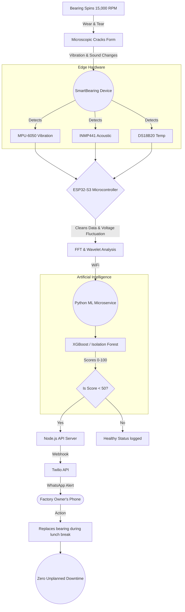
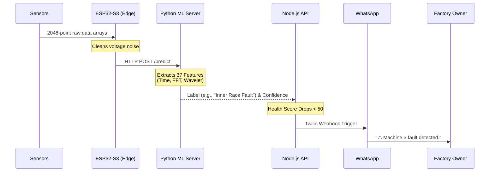

<div align="center">
  <h1>⚙️ SmartBearing</h1>
  <p><b>Zero Unplanned Downtime. Artificial Intelligence at the Edge.</b></p>
</div>

SmartBearing is an ultra-low-cost, IoT-powered predictive maintenance system designed specifically for textile MSME factories (like power looms and ring frame machines). By utilizing an ESP32-S3 microcontroller coupled with an array of vibration, acoustic, and temperature sensors, SmartBearing listens to the mathematical heartbeat of your machines and predicts bearing failures *weeks* before they happen.

No ₹3,00,000 corporate setups. No IT teams. Just a ₹1,800 magnetic box and a WhatsApp alert.

---

## 🛑 The Problem: The ₹12,000 Breakdown

Inside a textile ring frame machine, metal bearings spin at up to **15,000 RPM**. Over time, microscopic cracks form. These cracks create tiny vibrations and high-pitched acoustic anomalies entirely undetectable to human senses. 

When the bearing finally shatters:
1. Production **stops immediately**.
2. Diagnostics and repairs take **4 to 6 hours**.
3. The factory owner loses **₹12,000+** in a single shift.

And this happens repeatedly, unpredictably, across thousands of factories.

---

## 💡 The Solution: SmartBearing

SmartBearing is a matchbox-sized IoT device that attaches to the machine magnetically (zero drilling required). It runs continuous Machine Learning models directly on the raw sensor data, detecting the exact mathematical frequency spike (BPFO - Ball Pass Frequency Outer race) that indicates a microscopic crack.

### The Full Picture


---

## 🧩 The Hardware Stack

Our hardware is designed specifically for the chaotic environment of an Indian MSME factory floor.

| Component | Purpose | Why it matters |
|-----------|---------|----------------|
| **ESP32-S3** | The Brain | Handles high-speed data sampling and WiFi transmission cheaply. |
| **MPU-6050** | Vibration Sensor | Detects the physical shaking caused by bearing friction. |
| **INMP441** | I2S Microphone | Captures high-frequency acoustic friction beyond human hearing. |
| **DS18B20** | Temp Sensor | Monitors thermal anomalies when friction increases. |
| **ZMPT101B** | Voltage Sensor | **Crucial:** Automatically compensates for factory voltage fluctuations to prevent false positives (If voltage drops, the machine shakes differently—our system mathematically removes this noise). |

---

## 🧠 The ML & Software Architecture

Our intelligence runs in five distinct stages every single second:



### The 37-Feature ML Pipeline
The Python backend loads a highly optimized XGBoost / Isolation Forest model trained on the industry-standard **CWRU Bearing Dataset**. When it receives a 2048-point raw signal array, it extracts 37 distinct mathematical features:
- **Time Domain:** RMS, Kurtosis, Skewness, Crest Factor.
- **Frequency Domain:** FFT Mean, Spectral Entropy, Dominant BPFO Frequency.
- **Wavelet Domain:** PyWavelets `db4` coefficients to detect transient shock impacts.

---

## 💸 Why this hasn't existed before

Big companies like Siemens sell bearing monitoring systems. 
- **Siemens Cost:** ₹3,00,000–₹8,00,000.
- **Requirements:** Full-time IT person, complex internet infrastructure, massive installation downtime.

A small factory with 5 machines and one owner cannot use that. 

- **SmartBearing Cost:** **₹1,800 per unit.**
- **Requirements:** Plug it in, stick it to the machine with a magnet, connect to WiFi once, done. 

That massive gap—between ₹1,800 and ₹3,00,000—is where SmartBearing lives. And nobody was there before us.

---

## 🚀 Running the Project Locally

This repository contains the full end-to-end software stack (Frontend Dashboard + Node.js API + Python ML Server).

### Prerequisites
- **Node.js** (v18+) & **pnpm** (v9+)
- **Python** (v3.9+)

### 1. Start the Machine Learning Server
We use a FastAPI Python server to host the trained ML model.
```bash
# Windows
.\start-ml.bat
```
*(This automatically installs dependencies via `requirements.txt` and starts the server on port 8000).*

### 2. Start the Backend API & Simulator
This starts the backend and our intelligent `SensorSimulator.ts` which generates raw bearing harmonic signals to test the ML model.
```bash
pnpm install
set SIMULATOR_AUTO_START=true
pnpm --filter @workspace/api-server run dev
```

### 3. Start the Dashboard
```bash
pnpm --filter @workspace/smartbearing run dev
```
Open **http://localhost:5173** in your browser. Enter *any* email and password to log in.

---

## 🎨 Dashboard Features

- **Live Sensor Feed:** Watch real-time vibration, acoustic, and temperature data stream into the dashboard via WebSockets.
- **Machine Learning Integration:** Watch the ML model dynamically predict "Inner Race Fault" or "Ball Fault" based on live synthesized harmonic signals.
- **FFT Visualization:** View the actual frequency spikes (BPFO) that the AI detects.
- **ROI Calculator:** An interactive tool for factory owners to calculate exactly how much money SmartBearing saves them every month.
- **PDF & CSV Export:** One-click fleet reports for management.

---

## 👥 The Team
| Name | Role | Responsibilities |
|------|------|------------------|
| **Prateek** | AI & ML Architecture | Training XGBoost/Isolation Forest models, feature extraction, CAD (OnShape) enclosure design |
| **Varun Sreeram** | Backend API | Node.js Server, WebSocket streaming, Twilio WhatsApp Integration |
| **Vaishnav** | Frontend & UI/UX | React Dashboard, 3D visualizations, Recharts data plotting |
| **Sri Charan** | Operations & DevOps | GitHub repository management, code integrations |

---
<div align="center">
  <i>Built to bring enterprise-grade AI to the local factory floor.</i>
</div>
